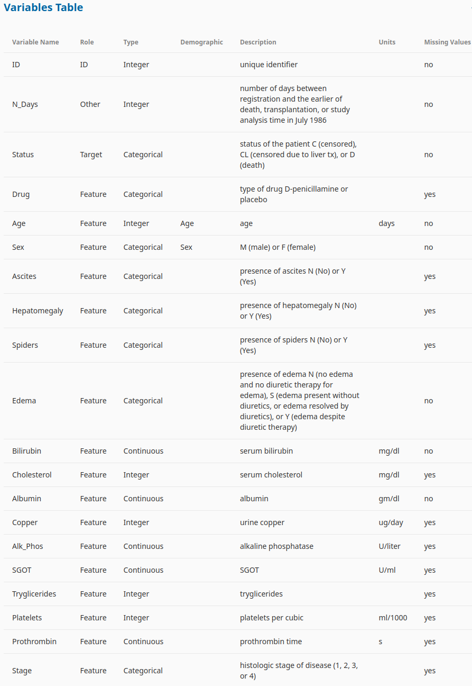

# Multi-Class-Prediction-of-Cirrhosis-Outcomes

We will try to predict the probability of patient's death, censore or censored due to liver transplantation. 
This repository contains a Jupyter Notebook, `Multi-Class Prediction of Cirrhosis Outcomes.ipynb`, which provides a predictive analysis and model constuction and selection. 
The notebook aims to help you understand and predict patient's death, censore and censored due to liver transplantation using data analysis and machine learning techniques.

<hr />




These variables are crucial for building predictive models to assess the risk of severe illness or mortality based on these factors.

## Introduction

Cirrhosis is a late stage of scarring (fibrosis) of the liver caused by many forms of liver diseases and conditions, such as hepatitis and chronic alcoholism. 
This project aims to predict cirrhosis outcomes using data analysis and machine learning. 
The Jupyter Notebook, `Multi-Class Prediction of Cirrhosis Outcomes.ipynb`, walks you through the process of loading, and analyzing Cirrhosis Outcomes. 


## Data

The data used is publicly available and can be obtained from a public datasets.
You can access the complete datasets in this Kaggle page:
https://www.kaggle.com/datasets/fedesoriano/cirrhosis-prediction-dataset <br />
https://www.kaggle.com/competitions/playground-series-s3e26/data <br />
The dataset  was generated from a deep learning model trained on the Cirrhosis Patient Survival Prediction dataset. Feature distributions are close to, but not exactly the same, as the original.
We combine both dataset for the modeling and prediction

## Installation

To run the Jupyter Notebook and perform the analysis, you'll need Python and some necessary libraries. You can set up your environment by following these steps:

1. Clone this repository to your local machine:

   git clone https://github.com/DRPproton/Multi-Class-Prediction-of-Cirrhosis-Outcomes.git

   Running a Python environment using Pipenv involves creating a virtual environment, managing dependencies, and running your Python scripts within that environment. Here are the steps to set up and run a Python environment using Pipenv:

1. **Install Pipenv (if not already installed)**:
   If you don't have Pipenv installed, you can do so using `pip`, the Python package manager. Open your terminal or command prompt and run the following command:

   ```bash
   pip install pipenv
   ```

2. **Navigate to Project Directory**:
   Navigate to project directory it using the terminal.

   ```bash
   cd project_directory
   ```

3. **Initialize a New Pipenv Environment and Install Dependencies**:
   Inside your project directory, run the following command to create a new Pipenv environment and install Python packages and dependencies for your project using `pipenv install`.
   
   ```bash
   pipenv install
   ```

   This will add the package to your `Pipfile` and install it within the virtual environment.

4. **Activate the Pipenv Shell** (Optional):
   If not already activated, you can activate the Pipenv shell to work within the virtual environment:

   ```bash
   pipenv shell
   ```

   Your terminal prompt will change to indicate that you are now working within the Pipenv virtual environment.

5. **Run Python Scripts**:
   You can now run your Python scripts within the Pipenv virtual environment. For example, if you have a script named `my_script.py`, you can run it with:
    
   ```bash
   python predict.py
   ```
   
6. **Run Jupyter Notebook**:
   You can now run the Notebook within the Pipenv virtual environment. For example, you can run it with:
    
   ```bash
   jupyter lab
   ```

   Any packages installed using `pipenv install` will be available for your scripts within the virtual environment.

## Run Flask API Locally and testing

1. **Run Python Scripts**:
   You can now run your Flask scripts within the Pipenv virtual environment.
   ```bash
   python predict.py
   ```
   
2. **Test APIs**:
   Open a new shell with the enviroment activated and run the script bellow to test the api.
   The test_api.py file have a sample of a patiente, feel free to change the parameters to see how the changes affect the result. 
  ```bash
   python test_api.py
   ```

   ```
     patient = {
      'N_Days': 3839,
      'Drug': 'D-penicillamine',
      'Age': 29724,
      'Sex': 'F',
      'Ascites': 'N',
      'Hepatomegaly': 'Y',
      'Spiders': 'N',
      'Edema': 'N',
      'Bilirubin': 2.2,
      'Cholesterol': 546.0,
      'Albumin': 3.37,
      'Copper': 65.0,
      'Alk_Phos': 1636.0,
      'SGOT': 151.9,
      'Tryglicerides': 90.0,
      'Platelets': 430.0,
      'Prothrombin': 10.6,
      'Stage': 3.0}
   ```

## Creating a Docker image using a Dockerfile involves several steps. Below are the commands and steps to build a Docker image from a Dockerfile:

1. **Navigate to the ***deployment_code*** folder inside the main project**:

2. **Build the Docker image**:
   Use the `docker build` command to build an image based on the Dockerfile. Replace `your-image-name` with the name you want to give to your Docker image:

   ```bash
   docker build -t your-image-name .
   ```

   The `.` at the end of the command indicates that the Dockerfile is located in the current directory.

3. **Check the list of Docker images**:
   To verify that your image was successfully created, use the `docker images` command:

   ```bash
   docker images
   ```
   You should see your newly created image in the list.

4. **Run a container from the Docker image (optional)**:
   If you want to test your image, you can run a container based on it using the `docker run` command. Replace `your-container-name` with a name for your container:

   ```bash
   docker run -it --rm -p 9696:9696 [containerName]
   ```
   The `-d` flag runs the container in detached mode. You can access the running container using its name.

5. **Test your application run Python Test Scripts**:
   Open a new shell with the enviroment activated and run the script bellow.
   ```bash
   python test_api.py
   ```
> ***Due to that we are using a free version for deployment sometimes take more than 30 seconds to get the result***

## Testing the live API
1. **Open files**:
   Open a new shell with the enviroment activated and run the script bellow.
   Open the file test_api.py in your IDE
   Uncomment lines 15 and 16 and comment line 19
3. **Test your application run Python Test Scripts**:
   Save file and run it on the shell using the command bellow.
   ```bash
   python test_api.py
   ```
> Deployed API in this address:  https://cirrhosis-outcomes-prediction.onrender.com/predict
   
## Deploy a Docker container in Render, follow these steps:

1. **Sign Up for Render:**
   If you haven't already, sign up for an account on the Render platform.

2. **Create a New Web Service:**
   Once you're logged in, click on the "New" button in the Render dashboard and select "Web Service" to create a new service.

3. **Connect a Git Repository (We used this one method):**
   You can connect a Git repository to Render, which will allow you to automatically deploy your Docker container whenever you push changes to your repository. This step is optional but can simplify the deployment process.

4. **Choose Your Repository:**
   If you've connected a Git repository, select it. If not, you can choose to deploy your container without a repository by selecting the "Docker" option.

5. **Configure Your Service:**
   Fill in the configuration details for your service, such as the name, environment (development or production), and the region where you want to deploy your Docker container.

6. **Define a Dockerfile:**
   Create a Dockerfile for your project if you haven't already. The Dockerfile should define the necessary instructions to build your Docker image. You can use any base image and specify the dependencies and commands required to run your application.

7. **Specify Build Settings:**
   If you're using a Git repository, Render will detect your Dockerfile automatically. If not, you'll need to specify the path to your Dockerfile in the "Build and Start Command" section. You can also define environment variables, if needed.

8. **Build and Deploy:**
   Click on the "Create Web Service" button. Render will build your Docker image and deploy your service based on the settings you provided.

9. **Monitor Deployment:**
   You can monitor the deployment progress in the Render dashboard. Render will provide you with a URL for your service, which you can access once the deployment is complete.

10. Configure Custom Domains (Optional):
    If you want to use a custom domain with your service, you can configure it in the Render dashboard.

11. **Scale Your Service (Optional):**
    If you need to scale your service, you can configure auto-scaling settings in the Render dashboard to handle increased traffic.

12. **Monitor and Maintain:**
    Use the Render dashboard to monitor your service's performance and make any necessary updates or changes.


   


   
